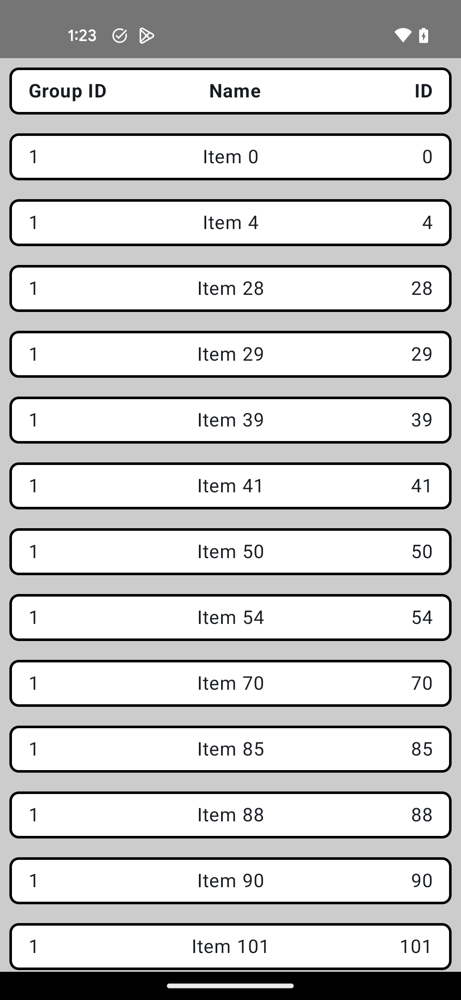

# Playground App

## Playing around with a few things, creating from scratch an app to show a list 

## Tools used: Compose, Hilt, Retrofit, Coroutines, Flow, Multi-module

## Things I could add : Much less basic UI, navigation for multi-screen, tests, further error handling, more refined UI, more compose previews, and more! 

## Screenshot

